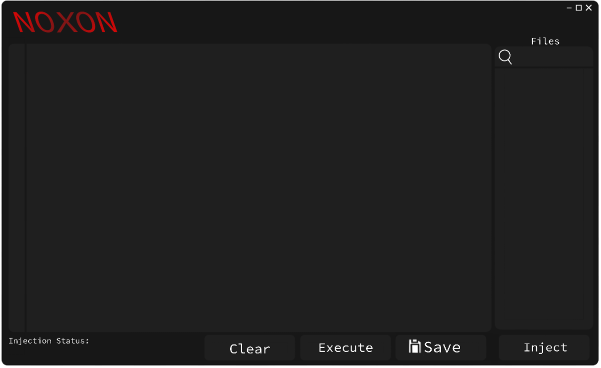

# Noxon-Executor

Noxon is an powerful yet easy to use executor based off RC7 and Synapse(X)!
We offer a free keyless executor for everyone to use, which does not get detected.
This is the ORIGINAL Github page, no other page is real and should be believed.
Made by the Instance.new team.

Requirements; 
Microsoft Visual Studio 2019/2022 C++ Supported
https://visualstudio.microsoft.com/

Microsoft Store Roblox aplication
https://apps.microsoft.com/detail/9nblgggzm6wm?hl=en-US&gl=NG

